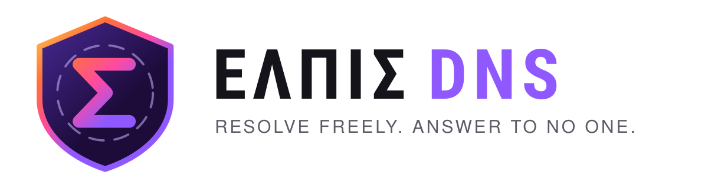

<p align="center">
	
</p>

# ΕΛΠΙΣ DNS

**By the community, for the community.**

Free, encrypted DNS for South East Asia. Ads and trackers blocked, no query
logs, and our own resolver answering all the way from the root &mdash; no ISP,
no Google, no Cloudflare in between. Run by volunteers on four community
networks, and aligned with the vision of
[EFF Internet Freedom and Privacy](https://www.eff.org/).

- **[Get your DNS](https://elpis.violetnetworks.xyz/#start)** &mdash; pick a filter, region and protocol, take the address
- **[Network](https://elpis.violetnetworks.xyz/network.html)** &mdash; where we answer from, ECS for CDNs, DNS64 for IPv6-only
- **[Resolver](https://elpis.violetnetworks.xyz/resolver.html)** &mdash; public recursive resolvers for your own AdGuard Home or Pi-hole
- **[ML-DSA-44](https://elpis.violetnetworks.xyz/ml-dsa-44.html)** &mdash; post-quantum DNSSEC explained, and how to test it yourself
- **[Setup guide](https://elpis.violetnetworks.xyz/setup.html)** &mdash; Android, iPhone, Windows, Firefox, Chrome, MikroTik, OpenWrt, AdGuard Home
- **[About](https://elpis.violetnetworks.xyz/mission.html)** &mdash; what we block, what we never keep, and how to check us
- **[Add your resolver](CONTRIBUTING.md)** &mdash; one JSON block, one pull request

## What you get

- Encrypted DNS over HTTPS and TLS, no query logging, no profiling
- Ads, trackers, malware and phishing filtered; a Family profile adds adult content and safe search
- Servers in Malaysia, Singapore and Indonesia
- ECS on `a.hitoha.moe` and `b.hitoha.moe` only, so YouTube and other CDNs serve you from the nearest cache
- DNS64 with our own NAT64 gateway for IPv6-only networks, like a VPS without IPv4 &mdash; use `64.hitoha.moe`
- An `sdns://` DNS stamp generated for every endpoint, for dnscrypt-proxy and friends
- [ΕΛΠΙΣ Resolver](https://github.com/PururinCollective/elpis-resolver) behind it all

## ΕΛΠΙΣ Resolver

Our own recursive resolver: portable C99, hand-written SIMD kernels, no
dependencies, built by the community with Claude AI assistance. It is the
second resolver in the world to validate
[ML-DSA-44](https://elpis.violetnetworks.xyz/ml-dsa-44.html) post-quantum DNSSEC
(algorithm 18, FIPS 204), and
it answers more than 30 million queries a day across our resolvers.

Running AdGuard Home or Pi-hole at home, the office or a business? Use these
as your upstream. They are unfiltered on purpose &mdash; your lists, our
recursion and DNSSEC.

| Server     | IPv4                  | IPv6                   |
|------------|-----------------------|------------------------|
| Fizo-1     | `151.158.198.47`      | `2402:4e20:6767::b00b` |
| Fizo-2     | `151.158.198.46`      | `2402:4e20:6767::bab1` |
| Sakurako-1 | `151.158.198.49:5301` | `2402:4e20:b00b::1001` |
| Sakurako-2 | `151.158.198.49:5302` | `2402:4e20:b00b::1111` |
| Kevin-1    | `89.23.82.53`         | `2402:4e20:bab1::1001` |
| Kevin-2    | `89.23.82.82`         | `2402:4e20:bab1::1111` |

> AS204535 (`89.23.82.0/24` and `2a0f:1cc6:bab1::/48`) is moving to a new BGP
> upstream, AS154516. The Kevin IPv4 addresses may change.

## Adding your DoH/DoT resolver

Everything the website shows comes out of one file: [`dns.json`](dns.json).
Copy a block inside `resolvers`, change the values, open a pull request.

```json
{
	"id": "sg-yourname-intl",
	"region": "SG",
	"provider": "Your Name",
	"filter": "NSFW",
	"network": "IPv4+IPv6",
	"feature": "International",
	"kind": ["DoH", "DoT"],
	"maintainer": "Your Name",
	"homepage": "https://example.com",
	"notes": "One sentence the visitor sees when this entry is selected.",
	"servers": ["dns.example.com"]
}
```

Your editor validates as you type against [`dns.schema.json`](dns.schema.json).
Non-standard DoH path or DoT port? Add `dohPath` or `dotPort`. A new country?
Add it to the `regions` list at the top of the file and the button appears by
itself. The full field reference and the expectations we have of a listed
resolver are in **[CONTRIBUTING.md](CONTRIBUTING.md)**.

## Running it locally

No build step, no framework, no dependencies. Serve the folder:

```
python -m http.server 8000
```

Then open <http://localhost:8000>. `file://` will not work &mdash; `dns.json` is
fetched over HTTP.

| File | What it holds |
| --- | --- |
| `dns.json` | Every resolver, region and filtering profile |
| `dns.schema.json` | Schema that validates the above in your editor |
| `index.html` | Home: the DNS lookup banner and the endpoint picker |
| `network.html` | The network map and the AS sites behind it |
| `resolver.html` | ΕΛΠΙΣ Resolver and its public addresses |
| `ml-dsa-44.html` | Post-quantum DNSSEC explained, with a test you can run |
| `setup.html` | Setup guide |
| `mission.html` | About: block lists, promises, how to check us |
| `style-main.css` | Colour tokens, light and dark themes, all components |
| `style-mobile.css` | Narrow layout |
| `js/app.js` | Selector engine, endpoint building, share links |
| `js/app-flow.js` | The DNS lookup animation in the home page banner |
| `js/app-map.js` | AS sites, cities and traffic on the network map |
| `js/app-nav.js` | The menu button on phones |
| `js/app-theme.js` | System / light / dark switching |
| `js/app-copy.js` | Clipboard, shared by every page |
| `js/app-stamp.js` | `sdns://` DNS stamp generator |
| `js/app-quote.js` | Footer quotes |
| `js/app-mikrotik.js` | RouterOS `.rsc` generator |
| `js/app-setup.js` | Setup page helpers, code block copy buttons |
| `img/resolver-mark.svg` | The ΕΛΠΙΣ Resolver mark, from elpis-resolver's `docs/images`; used as the `bi-resolver` icon |
| `img/sea-map.svg` | South East Asia land for the network map, generated |
| `img/hero-mesh.svg` | The light mesh behind every banner, generated |
| `tools/make-graphics.py` | Regenerates both of those. Only needed if you change them |
| `tools/make-og-card.py` | Renders the social cards in `tools/cards/` to `img/og-*.jpg` |
| `tools/stamp-assets.py` | Re-stamps `?hash=` cache busters after any asset change |

The look follows Firefox: night-violet banners with a glow underneath,
Mozilla Headline and Mozilla Text, violet pill buttons. The home page banner
plays one DNS lookup end to end &mdash; you, ΕΛΠΙΣ DNS, ΕΛΠΙΣ Resolver, the root,
the TLD and the name server &mdash; with light running along the wires the way
the mesh on [openpon.org](https://openpon.org/) does. The boxes are plain HTML,
so the same banner reflows on a phone.

The network map's land and the banner mesh are generated, because the land
is a few thousand points from Natural Earth that nobody should type by hand:

```
python tools/make-graphics.py
```

Pages can have their own social card, the picture Discord, Telegram and X
show when a link is shared. A card is a 1200 × 630 HTML page in
`tools/cards/`; headless Firefox photographs it:

```
python tools/make-og-card.py ml-dsa-44
```

That writes `img/og-ml-dsa-44.jpg`, which the page names in `og:image` and
`twitter:image`. It needs Firefox and Pillow (`pip install pillow`).

The map generator downloads world-atlas from jsDelivr each run; pass `--topojson` with a
local copy to work offline. The AS sites, cities and traffic on the map live
at the top of `js/app-map.js` &mdash; add a city there, no regeneration needed.

The site follows your operating system's light or dark preference out of the box;
the icon in the top bar cycles system, light and dark, and the choice is remembered.

### Cache busting

Asset links carry a content hash rather than a hand-maintained version number:

```
python tools/stamp-assets.py
```

Every local `.css`, `.js`, `.json` and `.svg` reference becomes
`style-main.css?hash=2338f332`, the first eight hex characters of the file's
SHA-256. Change a file and its URL changes with it, so Cloudflare has to
fetch the new copy; leave a file alone and the URL is stable, so nobody
re-downloads it. Run it after any asset change, or wire `--check` into CI to
be told when you forget. It follows references through files, so editing
`dns.json` re-stamps `js/app.js` and then the pages that load it.

## Usage

Quick way to use our DNS resolvers. The [setup page](https://elpis.violetnetworks.xyz/setup.html)
covers every platform in detail &mdash; here is the short version for routers.

### Android

Settings &rarr; Network &amp; internet &rarr; **Private DNS** &rarr; provider hostname:

```
b.hitoha.moe
```

### MikroTik

Basic DNS first:

```rsc
/ip dns
set servers=1.0.0.1,1.1.1.1 allow-remote-requests=yes
```

DoH forwarders:

```rsc
/ip dns forwarders
add doh-servers="https://b.hitoha.moe/dns-query,https://c.hitoha.moe/dns-query,https://gg.hitoha.moe/dns-query" name=AdGuard
```

Static entries so the router can find the resolver it is about to use:

```rsc
/ip dns static
add address=151.158.198.53 name=b.hitoha.moe type=A
add address=160.187.96.67 name=c.hitoha.moe type=A
add address=103.131.188.71 name=gg.hitoha.moe type=A
add name=* forward-to=AdGuard type=FWD
```

The front page will generate this file for whichever endpoint you pick &mdash;
press **.rsc**.

## Supported by

ΕΛΠΙΣ DNS runs on these community networks. Thank you for keeping it free.

- [AS154516](https://bgp.tools/as/154516) &mdash; Perfect Network, Semenyih, Malaysia
- [AS153334](https://bgp.tools/as/153334) &mdash; Origin TechLab, Kuala Lumpur, Malaysia
- [AS135134](https://bgp.tools/as/135134) &mdash; Shana Network, Singapore
- [AS204535](https://bgp.tools/as/204535) &mdash; Kevin Tan Networks, Kuala Lumpur, Malaysia

---

*~ Part of Pururin Collective Project ~*
